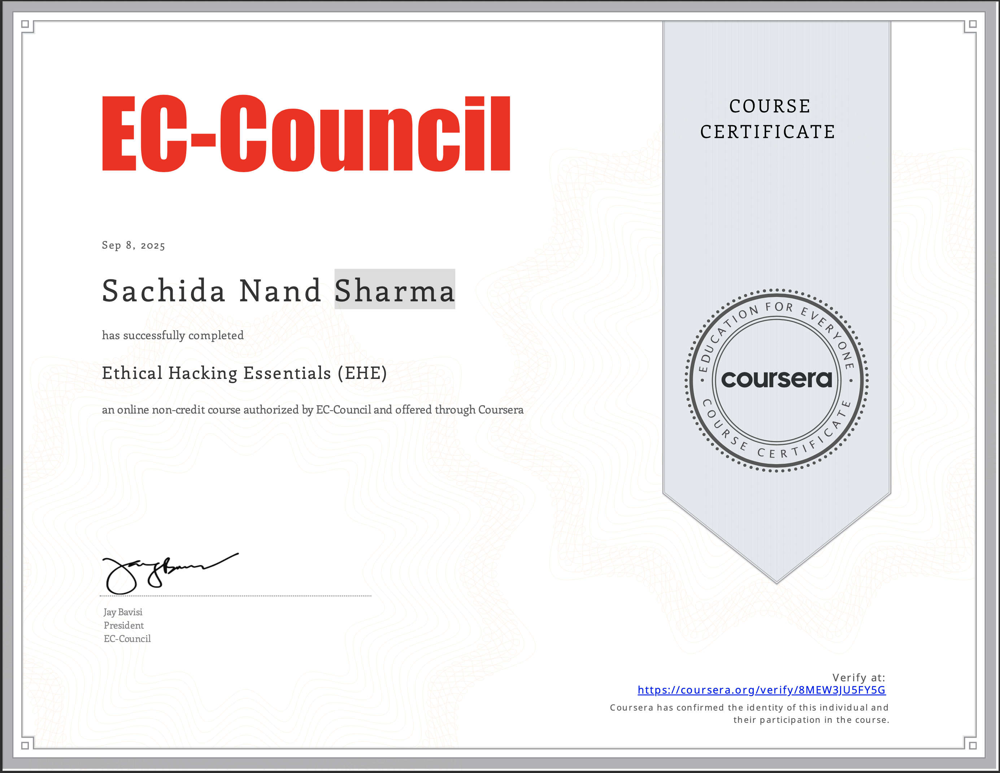

<!-- ULTIMATE MATTE BLACK HACKER PORTFOLIO README -->
<!-- No emojis, pure cyber aesthetic -->

<!-- ASCII Hacker Banner -->

  

<!-- Typing Intro -->

  

<!-- Snake Animation -->

  

---

## About Me

I’m **Sachida Sharma** → an **aspiring ethical hacker** obsessed with **exploits, web security, and digital forensics**.  

Currently:  
- Deep-diving into **TryHackMe / HackTheBox / PortSwigger Labs**  
- Preparing for **eJPT certification**  
- Building my arsenal for **Red Team & SOC roles**  

Goal: Become a **penetration tester** in the next 6 months.  

---

# Arsenal — Tools & Skills

### Foundations

---

### Web & Network Security

---

### Exploitation & Post-Exploitation

---

### Threat Hunting & Cloud Security

---

## My Learning Progress

| Platform        | Status   | Proof / Profile |
|-----------------|---------|------------------|
| **TryHackMe**   | Currently doing Jr. Penetration Tester Path | [View Profile](https://tryhackme.com/) |
| **Hack The Box** | Solving Starting Point & Easy Machines | [View Profile](https://hackthebox.com/) |
| **PortSwigger** | Practicing OWASP Top 10 Labs | [View Labs](https://portswigger.net/web-security) |
| **Certifications** | eJPT — In Progress | Coming Soon |

<!DOCTYPE html>
<html lang="en">
<head>
  <meta charset="UTF-8" />
  <meta name="viewport" content="width=device-width, initial-scale=1.0" />
  <title>Profile Tabs</title>
  
</head>
<body>

  

    <button class="tab active" onclick="openTab(event, 'completed')">✅ Completed Rooms</button>
    <button class="tab" onclick="openTab(event, 'certificates')">📜 Certificates</button>
    <button class="tab" onclick="openTab(event, 'skills')">📊 Skills Matrix</button>
    <button class="tab" onclick="openTab(event, 'badges')">🏆 Badges</button>
    <button class="tab" onclick="openTab(event, 'created')">📦 Created Rooms</button>
    <button class="tab" onclick="openTab(event, 'yearly')">📅 Yearly Activity</button>
  

  <!-- Panels -->
  

    <h2>Completed Rooms</h2>
    
List of completed rooms will appear here.

  

  

    <h2>Certificates</h2>
    
All earned certificates will appear here.

  

  

    <h2>Skills Matrix</h2>
    
Skills progress will appear here.

  

  

    <h2>Badges</h2>

  # 👨‍💻 My Cybersecurity Journey

Welcome to my profile! 🚀 Here’s a quick overview of my learning progress, achievements, and contributions.  

---

## ✅ Completed Rooms
- Linux Fundamentals
- Nmap Basics
- Web Exploitation
- Privilege Escalation

---

## 📜 Certificates
- [TryHackMe Linux Fundamentals](#)
- [Kali Linux Basics](#)
- [Ethical Hacking 101](#)

---

## 📊 Skills Matrix
| Skill              | Progress |
|--------------------|----------|
| Linux              | ██████████ 90% |
| Networking         | ████████░░ 70% |
| Web Exploitation   | █████████░ 85% |
| Cryptography       | ██████░░░░ 60% |
| Scripting (Python) | ██████░░░░ 55% |

---

## 🏆 Badges

### 🔹 First Four  
Completed four rooms in the first week!  
  

---

### 🔹 3 Day Streak  
Achieved a 3-day hacking streak.  
  

---

### 🔹 Raffle Royalty  
Participated in Hack2Win 2025!  
  

---

## 📦 Created Rooms
- [Beginner Linux Challenges](#)
- [Basic Web Pentesting](#)

---

## 📅 Yearly Activity
🔥 Consistently learning & practicing cybersecurity every week!  

  

  

    <h2>Created Rooms</h2>
    
Your created rooms will appear here.

  

  

    <h2>Yearly Activity</h2>
    
Yearly contributions and stats.

  

  

</body>
</html>

---

## Badges & Achievements

  

  

---
## 📜 Certifications

### ✅ My Coursera Certificate  

)

---

## Badges

  
  

---

## GitHub Stats

  
  

  

---

## Contact

---

<!-- Futuristic Footer -->

  

